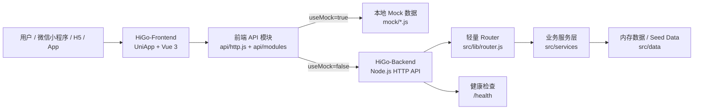
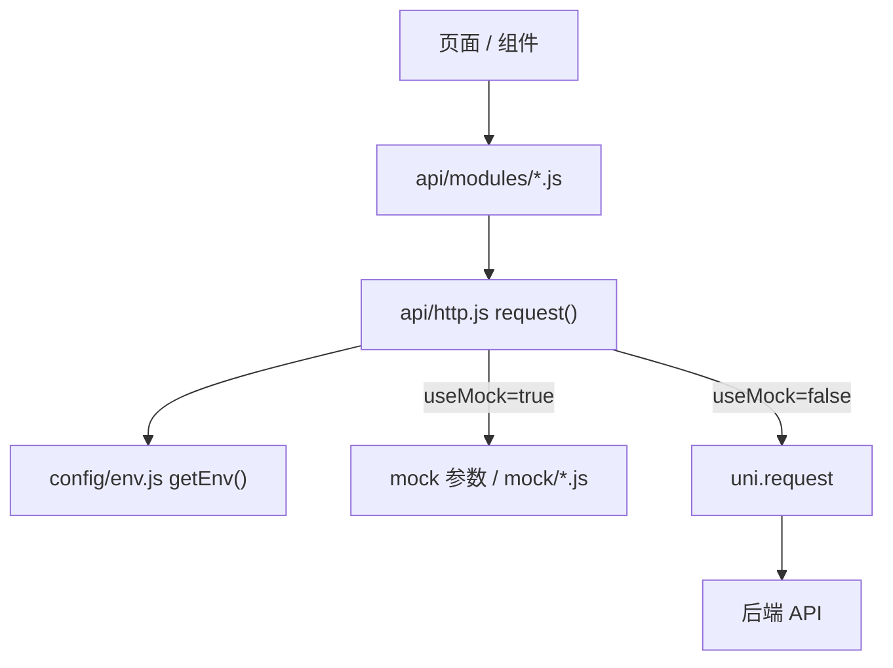
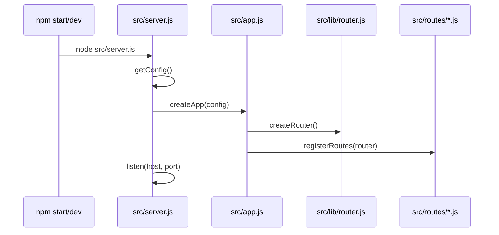
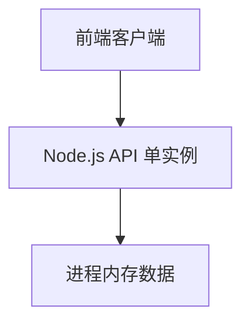
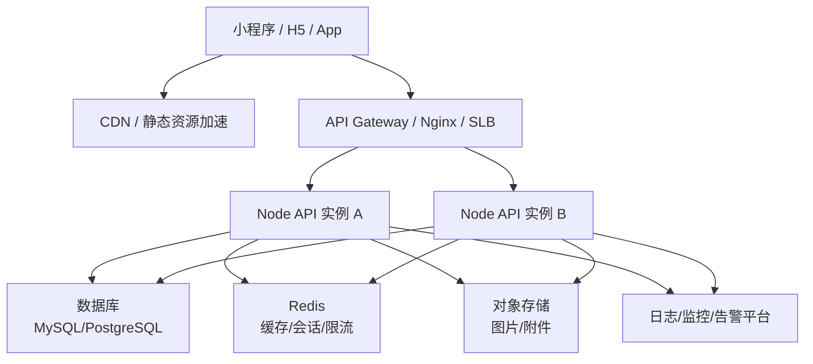

# HiGo / UnitOne 前后端项目企业版技术文档

| 文档属性 | 内容 |
| --- | --- |
| 项目名称 | HiGo / UnitOne |
| 文档版本 | v1.0 |
| 文档日期 | 2026-08-12 |
| 适用范围 | 前端 UniApp/Vue3 项目、后端 Node.js API 项目 |
| 目标读者 | 技术负责人、前后端研发、测试、运维、项目交付与企业客户技术评审人员 |

## 1. 项目概述

HiGo / UnitOne 是一个面向同城兴趣活动、活动动态、消息通知和个人小队管理的多端应用项目。当前仓库由前端与后端两部分组成：

- `HiGo-Frontend`：基于 UniApp 与 Vue 3 的多端前端工程，支持微信小程序、H5、App 等目标端。
- `HiGo-Backend`：基于 Node.js 原生 `http` 模块实现的轻量级后端 API 服务，用于对接当前前端调用契约。

当前版本以移动端体验与前后端接口契约打通为核心，后端数据仍以内存数据与种子数据为主，适合作为 MVP、演示联调、接口原型和后续企业化改造基础。

## 2. 系统定位与业务边界

### 2.1 业务定位

系统围绕“活动发现与参与”展开，提供以下核心能力：

- 活动首页：展示活动列表、分类筛选、轮播推荐、城市搜索入口。
- 活动详情：展示活动封面、标题、时间、地点、费用、组织者、参与热度和详细说明。
- 创建活动：支持用户填写活动标题、类型、时间、地点、费用、封面和富文本描述。
- 动态时刻：以社交信息流方式展示活动相关图文动态，并通过 Stories 区域复用活动数据。
- 消息中心：展示系统公告、活动消息、账号提醒、安全通知等消息列表。
- 个人中心：展示用户资料、小队管理、服务入口、数据统计、头像裁剪和发布活动入口。
- 小队管理：支持查看小队卡片、进入小队详情、创建小队表单占位。
- 登录鉴权：支持用户名密码登录，后端签发 JWT 格式 Token，前端本地存储并自动带上 Authorization 头。

### 2.2 当前边界

当前代码实现属于“产品原型 + 接口联调底座”阶段：

- 后端未接入持久化数据库，活动、消息、动态数据均在进程内存中维护。
- 登录仅校验非空用户名与密码，不包含真实用户体系、密码哈希、短信、OAuth 或微信登录。
- 活动创建成功后写入后端内存，服务重启后新增活动会丢失。
- 创建小队、报名、评论、分享、收藏、支付、订单等功能仍为前端占位或 Mock。
- 前端默认 `useMock: true`，切换真实后端需修改运行时配置。

## 3. 总体技术架构

### 3.1 架构视图



### 3.2 分层说明

| 层级 | 前端实现 | 后端实现 | 职责 |
| --- | --- | --- | --- |
| 表现层 | `pages/`、`src/`、`components/` | 无 | 页面渲染、用户交互、状态提示 |
| 应用层 | `api/modules/*.js` | `src/routes/*.js` | 业务入口、接口语义、路由注册 |
| 基础设施层 | `api/http.js`、`config/env.js` | `src/lib/http.js`、`src/lib/router.js`、`src/config.js` | 请求封装、响应解包、路由匹配、CORS、配置读取 |
| 数据层 | `mock/*.js` | `src/data/*.js`、服务内存数组 | Mock 数据、种子数据、临时运行时数据 |

## 4. 技术栈说明

### 4.1 前端技术栈

| 技术 | 版本/形态 | 用途 |
| --- | --- | --- |
| UniApp | HBuilderX 工程形态 | 多端编译与运行 |
| Vue | Vue 3 | 页面与组件开发 |
| SCSS | `uni.scss`、组件 `<style lang="scss">` | 全局主题令牌与样式组织 |
| uni_modules | `uni-icons`、`uni-load-more`、`uni-data-picker`、`qf-image-cropper` 等 | 图标、加载、选择器、图片裁剪能力 |
| uni.request | 原生请求能力 | 真实 API 请求 |
| Mock 拦截 | `api/http.js` | 本地离线开发与联调降级 |

### 4.2 后端技术栈

| 技术 | 版本/形态 | 用途 |
| --- | --- | --- |
| Node.js | `>=16.14` | 后端运行环境 |
| 原生 `http` 模块 | 零第三方依赖 | HTTP 服务 |
| 原生 `crypto` 模块 | 内置模块 | JWT HMAC-SHA256 签名与活动 ID 生成 |
| 自定义 Router | `src/lib/router.js` | GET/POST 路由注册与匹配 |
| 原生测试脚本 | `node:test` 未使用，当前为自定义断言脚本 | API 冒烟测试 |

## 5. 工程目录结构

### 5.1 仓库结构

```text
unitone/
├─ HiGo-Frontend/              前端 UniApp 工程
├─ HiGo-Backend/               后端 Node.js API 工程
├─ docs/                       企业级项目文档
├─ logo 图片/                  设计/品牌素材
├─ 0.js                        根目录独立脚本
├─ 1.md                        根目录说明或草稿文档
└─ 陆伟炫简历.pdf              根目录 PDF 资料
```

### 5.2 前端关键目录

```text
HiGo-Frontend/
├─ App.vue                     应用根组件
├─ main.js                     Vue/UniApp 应用入口
├─ pages.json                  页面路由与导航样式配置
├─ manifest.json               应用清单、多端配置、微信小程序 AppID
├─ config/env.js               API 地址、Mock 开关、请求超时配置
├─ constants/api-paths.js      后端接口路径常量
├─ api/http.js                 请求封装、鉴权头、业务响应解包、Mock 拦截
├─ api/modules/                auth、activity、message、moment 接口模块
├─ components/                 跨页面公共组件
├─ pages/                      主 Tab 页面与部分页面私有组件
├─ src/                        登录、活动详情、创建活动、创建小队等业务页
├─ mock/                       前端 Mock 数据
├─ utils/                      通用工具函数
├─ static/                     本地静态资源
└─ uni_modules/                UniApp 插件依赖
```

### 5.3 后端关键目录

```text
HiGo-Backend/
├─ package.json                后端项目元信息与脚本
├─ README.md                   后端简版说明
├─ src/server.js               服务启动入口
├─ src/app.js                  HTTP Server 创建、CORS、路由分发、错误处理
├─ src/config.js               环境变量配置读取
├─ src/lib/http.js             JSON 响应、请求体解析、CORS、query 转换
├─ src/lib/router.js           轻量路由器
├─ src/routes/                 auth、activities、messages、moment 路由注册
├─ src/services/               业务服务实现
├─ src/data/                   种子数据
└─ test/api.test.js            后端 API 冒烟测试
```

## 6. 前端设计说明

### 6.1 应用入口

前端入口由 `main.js` 和 `App.vue` 组成：

- `main.js` 针对 Vue 2 与 Vue 3 做了 UniApp 条件编译，当前清单中 `vueVersion` 为 `3`，实际使用 `createSSRApp(App)`。
- `App.vue` 注册应用生命周期 `onLaunch`、`onShow`、`onHide`，当前主要用于调试日志。
- `manifest.json` 中应用名为 `UnitOne`，微信小程序 AppID 为 `wxc7433c6549a52b54`。

### 6.2 路由与导航

页面路由统一配置在 `pages.json`：

| 序号 | 路由 | 页面说明 | 导航模式 |
| --- | --- | --- | --- |
| 1 | `pages/index/index` | 首页/活动页 | 继承全局 custom |
| 2 | `pages/moment/moment` | 动态/时刻页 | 继承全局 custom |
| 3 | `pages/message/message` | 消息页 | 继承全局 custom |
| 4 | `pages/user/user` | 我的页 | 继承全局 custom |
| 5 | `pages/user/components/squad-detail` | 小队详情 | default |
| 6 | `src/login/login` | 登录页 | default |
| 7 | `src/activity-detail/activity-detail` | 活动详情 | 继承全局 custom |
| 8 | `src/create-activity/create-activity` | 创建活动 | 继承全局 custom |
| 9 | `src/create-unit/create-unit` | 创建小队 | default |

全局 `navigationStyle` 为 `custom`，主 Tab 页通过 `PageScaffold` 统一组合顶部栏、内容区和自定义底部 TabBar。

### 6.3 组件体系

| 组件 | 路径 | 职责 |
| --- | --- | --- |
| 页面骨架 | `components/page-scaffold.vue` | 统一主 Tab 页面结构，注入 `TopBar` 与 `BottomTabBar` |
| 顶部栏 | `components/top-bar.vue` | 主页面顶部视觉区域 |
| 底部 TabBar | `components/bottom-tab-bar.vue` | 自定义四栏导航，使用 `uni.reLaunch` 切换主页面 |
| 活动卡片 | `components/home-activity-card.vue` | 拉取活动列表、按分类过滤、跳转活动详情 |
| 轮播组件 | `components/swiper-bar.vue` | 首页图片轮播 |
| 动态信息流 | `components/moment-feed.vue` | Stories、图文动态、点赞、评论预览、操作入口 |
| 系统消息 | `components/system-push-message.vue` | 消息列表展示 |
| 用户相关组件 | `pages/user/components/*.vue` | 用户资料、小队卡片、服务入口、发布按钮、小队详情 |

### 6.4 前端 API 调用机制

前端 API 调用分为三层：



核心机制：

- `config/env.js` 控制 `apiBaseUrl`、`useMock`、`requestTimeoutMs`。
- `api/modules/*.js` 只声明业务接口，不直接判断 `useMock`。
- `api/http.js` 在 `useMock === true` 时返回深拷贝后的 Mock 数据。
- `api/http.js` 在 `useMock === false` 时调用 `uni.request`。
- 登录成功后，`api/modules/auth.js` 将 Token 写入 `uni.setStorageSync('token')`。
- 真实请求时，`api/http.js` 会读取本地 Token 并附加 `Authorization: Bearer <token>`。
- 后端响应采用统一业务包裹结构，前端会自动解包 `data` 字段。

### 6.5 页面业务说明

#### 首页

路径：`pages/index/index`

主要能力：

- 展示顶部品牌区域、城市搜索框、分类栏、轮播图与活动卡片列表。
- 下拉刷新时调用 `HomeActivityCard.refresh()` 重新加载活动。
- 分类栏通过 `uni.$emit('index:category-change')` 通知活动卡片筛选。
- 搜索框当前以 Toast 形式展示关键词，尚未接入真实搜索结果页。

#### 动态页

路径：`pages/moment/moment`

主要能力：

- 调用 `fetchHomeActivityList()` 获取活动列表，用于 Stories 横向入口。
- 调用 `fetchMomentPosts()` 获取动态信息流。
- 下拉刷新复用 `loadFeed()`。
- 动态卡支持点赞本地状态、评论入口、分享入口、收藏入口等交互占位。

#### 消息页

路径：`pages/message/message`

主要能力：

- 调用 `fetchMessageList()` 获取消息列表。
- 下拉刷新复用 `loadMessages()`。
- 消息类型包括系统公告、活动消息、账号提醒、安全中心等。

#### 我的页

路径：`pages/user/user`

主要能力：

- 展示用户头像、昵称、资料数据、小队管理、服务入口和活动发布按钮。
- 未登录状态点击用户名跳转登录页。
- 登录成功通过页面事件通道回传 `loginSuccess`，更新本地登录状态。
- 头像裁剪使用 `qf-image-cropper`。
- 发布活动按钮包含 3 秒气泡动效后跳转创建活动页。

#### 登录页

路径：`src/login/login`

主要能力：

- 采集用户名与密码。
- 调用 `loginWithPassword()`。
- 登录成功后存储 Token，并通过 opener event channel 通知来源页。

#### 活动详情页

路径：`src/activity-detail/activity-detail`

主要能力：

- 从路由参数 `item` 中读取活动 JSON。
- 对字段进行兼容性归一化，如 `joinAvatars`/`join_avatars`、`tagText`/`tag_text`。
- 格式化活动时间。
- 展示报名、分享等占位入口。

#### 创建活动页

路径：`src/create-activity/create-activity`

主要能力：

- 支持封面选择、活动类型选择、日期时间选择、地点与费用输入。
- 使用 `editor` 支持富文本活动描述与插图。
- 提交前校验活动标题必填。
- 调用 `createActivity()` 创建活动。
- Mock 模式下返回本地构造 ID；真实模式下由后端创建并写入内存列表。

#### 创建小队页

路径：`src/create-unit/create-unit`

主要能力：

- 支持小队头像选择。
- 小队名称限制：仅中文、英文字母、数字、半角空格。
- 小队名称展示宽度限制：中文计 2，英文/数字/空格计 1，总宽度最大 16。
- 小队简介最大 100 字符。
- 当前提交逻辑为接口待接入占位。

## 7. 后端设计说明

### 7.1 服务启动流程



启动入口 `src/server.js` 完成配置读取、创建 HTTP 服务、监听端口，并注册 `SIGINT`、`SIGTERM` 优雅关闭逻辑。

### 7.2 配置项

后端配置由 `src/config.js` 从环境变量读取：

| 环境变量 | 默认值 | 说明 |
| --- | --- | --- |
| `HOST` | `0.0.0.0` | 服务监听地址 |
| `PORT` | `3000` | 服务监听端口 |
| `CORS_ORIGIN` | `*` | 允许跨域来源 |
| `JWT_SECRET` | `unitone-dev-secret` | JWT 签名密钥 |

企业部署时必须覆盖 `JWT_SECRET`，并按实际域名收敛 `CORS_ORIGIN`。

### 7.3 HTTP 基础能力

后端基础能力集中在 `src/lib/http.js`：

- 统一 JSON 输出。
- 成功响应封装为 `{ code, success, message, data }`。
- 失败响应封装为 `{ code, success, message, data: null }`。
- 自动设置 CORS 响应头。
- 支持 `OPTIONS` 预检请求。
- 解析 JSON 请求体。
- 限制请求体最大 1MB。
- 将 URLSearchParams 转换为普通 query 对象。

### 7.4 路由机制

后端使用 `src/lib/router.js` 中的轻量路由器：

- 支持 `router.get(path, handler)`。
- 支持 `router.post(path, handler)`。
- 路径会做尾部斜杠归一化。
- 当前不支持路径参数、通配符、中间件链和嵌套路由。

### 7.5 服务层与数据层

| 模块 | 路由文件 | 服务文件 | 数据来源 |
| --- | --- | --- | --- |
| 登录 | `src/routes/auth.js` | `src/services/auth-service.js` | 请求体 + JWT 密钥 |
| 活动 | `src/routes/activities.js` | `src/services/activity-service.js` | `src/data/activities.js` + 运行时内存数组 |
| 消息 | `src/routes/messages.js` | `src/services/message-service.js` | `src/data/messages.js` + 运行时内存数组 |
| 动态 | `src/routes/moment.js` | `src/services/moment-service.js` | `src/data/moment-posts.js` + 运行时内存数组 |

## 8. 接口规范

### 8.1 通用响应格式

成功响应：

```json
{
  "code": 0,
  "success": true,
  "message": "ok",
  "data": {}
}
```

失败响应：

```json
{
  "code": 400,
  "success": false,
  "message": "Invalid JSON body",
  "data": null
}
```

### 8.2 接口清单

| 方法 | 路径 | 说明 | 前端模块 |
| --- | --- | --- | --- |
| `GET` | `/health` | 服务健康检查 | 无 |
| `POST` | `/api/v1/auth/login` | 用户登录 | `api/modules/auth.js` |
| `GET` | `/api/v1/activities` | 活动列表 | `api/modules/activity.js` |
| `POST` | `/api/v1/activities` | 创建活动 | `api/modules/activity.js` |
| `GET` | `/api/v1/messages` | 消息列表 | `api/modules/message.js` |
| `GET` | `/api/v1/moment/posts` | 动态列表 | `api/modules/moment.js` |

### 8.3 健康检查

请求：

```http
GET /health
```

响应数据：

| 字段 | 类型 | 说明 |
| --- | --- | --- |
| `name` | string | 服务名称 |
| `status` | string | 服务状态，正常为 `ok` |
| `time` | string | 服务端 ISO 时间 |

### 8.4 登录接口

请求：

```http
POST /api/v1/auth/login
Content-Type: application/json
```

请求体：

```json
{
  "username": "shawn",
  "password": "demo"
}
```

业务规则：

- `username` 与 `password` 均不能为空。
- 当前版本不校验账号真实性。
- Token 使用 HMAC-SHA256 签名，载荷包含 `sub`、`displayName`、`iat`、`exp`。
- Token 有效期为 7 天。

响应数据：

```json
{
  "token": "header.payload.signature",
  "displayName": "shawn"
}
```

### 8.5 活动列表接口

请求：

```http
GET /api/v1/activities
```

支持查询参数：

| 参数 | 类型 | 说明 |
| --- | --- | --- |
| `category_id` / `categoryId` | number/string | 按活动分类筛选 |
| `tagText` | string | 按活动标签筛选 |
| `keyword` / `q` | string | 按标题、地点、组织者、标签搜索 |
| `offset` | number | 分页偏移量 |
| `limit` | number | 返回数量 |

响应数据字段：

| 字段 | 类型 | 说明 |
| --- | --- | --- |
| `id` / `name` | string | 活动标识 |
| `category_id` | number | 分类 ID |
| `tagText` | string | 分类标签 |
| `cover` | string | 封面图 URL |
| `title` | string | 活动标题 |
| `location_text` | string | 活动地点文本 |
| `time_text` | string | 活动时间文本 |
| `fee_note` | string | 费用说明 |
| `detail_paragraphs` | string[] | 详情段落 |
| `org_avatar` | string | 组织者头像 |
| `org_name` | string | 组织者名称 |
| `joinCount` | number | 参与人数 |
| `joinAvatars` | string[] | 参与者头像列表 |

### 8.6 创建活动接口

请求：

```http
POST /api/v1/activities
Content-Type: application/json
```

请求体示例：

```json
{
  "title": "测试活动",
  "type": "户外出游",
  "time": "2026-05-22 19:30",
  "location": "深圳湾公园",
  "price": "30",
  "description": "<p>一起散步</p>",
  "cover": "https://example.com/cover.jpg"
}
```

业务规则：

- `title` 必填。
- `type` 会映射为后端分类与标签。
- `time` 支持 `YYYY-MM-DD HH:mm` 与 ISO-like 字符串，后端会做基础归一化。
- `description` 会剥离 HTML 标签并转换为 `detail_paragraphs`。
- `price` 为空或为 `0` 时费用说明为 `免费`，否则为 `费用 ¥<price>/人`。
- 创建后的活动插入内存数组头部。

活动类型映射：

| 前端类型 | category_id | tagText |
| --- | --- | --- |
| 运动健身 | 1 | 约球 |
| 演出观赛 | 2 | 观影 |
| 户外出游 | 3 | 户外 |
| 线下聚会 | 4 | 闲聊 |
| 线上活动 | 6 | 订阅 |
| 其他 | 4 | 其他 |

成功状态码：`201 Created`

### 8.7 消息列表接口

请求：

```http
GET /api/v1/messages
```

支持查询参数：

| 参数 | 类型 | 说明 |
| --- | --- | --- |
| `read` | boolean/string | 按已读状态筛选，支持 `true`/`1` |
| `type` | string | 按消息类型筛选 |

响应字段：

| 字段 | 类型 | 说明 |
| --- | --- | --- |
| `id` | number | 消息 ID |
| `type` | string | 消息类型 |
| `title` | string | 消息标题 |
| `content` | string | 消息内容 |
| `time` | string | 展示时间 |
| `read` | boolean | 是否已读 |

### 8.8 动态列表接口

请求：

```http
GET /api/v1/moment/posts
```

支持查询参数：

| 参数 | 类型 | 说明 |
| --- | --- | --- |
| `keyword` / `q` | string | 按用户名、活动标题、内容搜索 |
| `offset` | number | 分页偏移量 |
| `limit` | number | 返回数量 |

响应字段：

| 字段 | 类型 | 说明 |
| --- | --- | --- |
| `id` | number/string | 动态 ID |
| `name` | string | 发布者昵称 |
| `avatar` | string | 发布者头像 |
| `activityTitle` | string | 关联活动标题 |
| `content` | string | 正文 |
| `images` | string[] | 图片列表 |
| `time` | string | 展示时间 |
| `likeCount` | number | 点赞数 |
| `likes` | string[] | 点赞用户名 |
| `comments` | object[] | 评论预览 |

## 9. 数据模型建议

当前项目尚未接入数据库。企业版落地建议设计以下核心表或集合。

### 9.1 用户表 `users`

| 字段 | 类型 | 说明 |
| --- | --- | --- |
| `id` | string | 用户唯一 ID |
| `username` | string | 登录名 |
| `password_hash` | string | 密码哈希 |
| `display_name` | string | 展示昵称 |
| `avatar_url` | string | 头像地址 |
| `phone` | string | 手机号 |
| `status` | string | 用户状态 |
| `created_at` | datetime | 创建时间 |
| `updated_at` | datetime | 更新时间 |

### 9.2 活动表 `activities`

| 字段 | 类型 | 说明 |
| --- | --- | --- |
| `id` | string | 活动 ID |
| `category_id` | number | 分类 ID |
| `tag_text` | string | 标签文本 |
| `title` | string | 活动标题 |
| `cover_url` | string | 封面 URL |
| `location_text` | string | 地点文本 |
| `start_time` | datetime | 活动开始时间 |
| `fee_note` | string | 费用说明 |
| `description_html` | text | 富文本描述 |
| `description_text` | text | 纯文本描述 |
| `org_user_id` | string | 发起人用户 ID |
| `join_count` | number | 参与人数冗余 |
| `status` | string | 草稿、发布、取消、结束等状态 |
| `created_at` | datetime | 创建时间 |
| `updated_at` | datetime | 更新时间 |

### 9.3 报名表 `activity_participants`

| 字段 | 类型 | 说明 |
| --- | --- | --- |
| `id` | string | 记录 ID |
| `activity_id` | string | 活动 ID |
| `user_id` | string | 用户 ID |
| `status` | string | 已报名、已取消、已签到 |
| `created_at` | datetime | 报名时间 |

### 9.4 动态表 `moment_posts`

| 字段 | 类型 | 说明 |
| --- | --- | --- |
| `id` | string | 动态 ID |
| `user_id` | string | 发布者 ID |
| `activity_id` | string | 关联活动 ID |
| `content` | text | 文本内容 |
| `images` | json | 图片 URL 列表 |
| `like_count` | number | 点赞数 |
| `comment_count` | number | 评论数 |
| `status` | string | 正常、隐藏、删除 |
| `created_at` | datetime | 创建时间 |

### 9.5 小队表 `squads`

| 字段 | 类型 | 说明 |
| --- | --- | --- |
| `id` | string | 小队 ID |
| `name` | string | 小队名称 |
| `intro` | string | 小队简介 |
| `avatar_url` | string | 小队头像 |
| `cover_url` | string | 小队封面 |
| `owner_user_id` | string | 队长用户 ID |
| `member_count` | number | 成员数冗余 |
| `activity_count` | number | 活动数冗余 |
| `status` | string | 正常、冻结、解散 |
| `created_at` | datetime | 创建时间 |

## 10. 鉴权与安全设计

### 10.1 当前实现

- 后端登录接口签发 JWT 格式 Token。
- 前端将 Token 存储在本地 `uni` storage。
- 前端真实请求时附加 `Authorization` 请求头。
- 后端当前未校验受保护接口的 Authorization 头。

### 10.2 企业版建议

企业生产环境应补齐以下安全能力：

- 密码必须使用 `bcrypt`、`argon2` 或企业统一身份平台，不允许明文或弱哈希。
- JWT 密钥必须来自安全环境变量或密钥管理服务，不允许使用默认开发密钥。
- 后端增加鉴权中间件，区分公开接口与登录态接口。
- 增加 Token 续期、刷新 Token、退出登录与 Token 吊销机制。
- 对活动创建、文件上传、富文本内容增加权限校验与内容安全审核。
- 收敛 CORS 来源，不建议生产环境使用 `*`。
- 增加请求频率限制，防止登录爆破与接口滥用。
- 对所有外部输入进行服务端校验，前端校验仅作为体验优化。
- 富文本描述需做 XSS 清洗，图片资源需做类型、大小、病毒与违规内容校验。
- 接入审计日志，记录登录、创建活动、报名、支付、敏感资料变更等事件。

## 11. 配置与环境管理

### 11.1 前端环境配置

当前配置位于 `HiGo-Frontend/config/env.js`：

```js
export function getEnv () {
  return {
    apiBaseUrl: 'http://127.0.0.1:3001',
    useMock: true,
    requestTimeoutMs: 15000,
  }
}
```

建议企业版改造方向：

- 按开发、测试、预发、生产拆分配置。
- 通过构建变量注入 `apiBaseUrl` 与 `useMock`。
- 发布包中禁止默认启用 Mock。
- 小程序合法域名、图片 CDN 域名、上传域名统一纳入发布检查。

### 11.2 后端环境配置

后端通过环境变量配置：

```bash
HOST=0.0.0.0
PORT=3000
CORS_ORIGIN=https://example.com
JWT_SECRET=replace-with-strong-secret
```

建议企业版新增：

- `NODE_ENV`
- `DATABASE_URL`
- `REDIS_URL`
- `LOG_LEVEL`
- `UPLOAD_BUCKET`
- `UPLOAD_REGION`
- `SENTRY_DSN` 或企业监控平台 DSN
- `RATE_LIMIT_WINDOW_MS`
- `RATE_LIMIT_MAX`

## 12. 本地开发与运行

### 12.1 后端运行

```bash
cd HiGo-Backend
npm start
```

开发运行：

```bash
cd HiGo-Backend
npm run dev
```

冒烟测试：

```bash
cd HiGo-Backend
npm test
```

### 12.2 前端运行

推荐使用 HBuilderX：

1. 打开 `HiGo-Frontend` 目录。
2. 选择运行到微信开发者工具、浏览器 H5 或 App。
3. 如需对接真实后端，将 `config/env.js` 中 `useMock` 改为 `false`，并配置 `apiBaseUrl`。

真实后端联调示例：

```js
apiBaseUrl: 'http://127.0.0.1:3000',
useMock: false,
```

注意：当前前端配置中的 `apiBaseUrl` 为 `http://127.0.0.1:3001`，后端默认端口为 `3000`。联调前需统一端口，避免请求失败。

## 13. 测试策略

### 13.1 当前测试

后端包含 `test/api.test.js`，覆盖：

- `/health` 统一响应结构。
- `/api/v1/activities` 活动列表字段契约。
- `POST /api/v1/activities` 创建活动字段映射。
- `POST /api/v1/auth/login` 登录与 Token 格式。

### 13.2 企业版测试建议

| 测试类型 | 建议范围 |
| --- | --- |
| 单元测试 | 工具函数、服务层、参数校验、数据映射 |
| 接口测试 | 登录、活动、消息、动态、小队、报名等 API |
| 组件测试 | 活动卡片、动态流、消息列表、表单组件 |
| E2E 测试 | 登录、浏览活动、创建活动、进入详情、下拉刷新 |
| 契约测试 | 前端字段与后端响应格式一致性 |
| 安全测试 | 鉴权绕过、XSS、恶意上传、频率限制 |
| 性能测试 | 活动列表分页、图片加载、接口 QPS、冷启动耗时 |

## 14. 日志、监控与可观测性

### 14.1 当前状态

- 前端主要通过 Toast 展示错误。
- 后端 500 错误会输出到 `console.error`。
- 未接入结构化日志、链路追踪、指标监控与告警。

### 14.2 企业版建议

- 后端输出 JSON 结构化日志，包含 `request_id`、用户 ID、路径、耗时、状态码。
- 前端统一错误上报，记录页面、接口、端类型、网络状态。
- 接入健康检查、接口延迟、错误率、内存、CPU、重启次数监控。
- 关键业务增加埋点：登录成功率、活动曝光、活动点击、创建活动转化、报名转化。
- 生产环境接入告警策略，如 5xx 激增、登录失败激增、消息队列堆积、数据库连接异常。

## 15. 部署架构建议

### 15.1 当前可运行形态

当前后端可作为单进程 Node.js 服务运行：



此形态适合本地开发、Demo 与接口联调，不适合生产环境。

### 15.2 企业生产形态建议



生产建议：

- API 服务无状态化，横向扩容。
- 数据持久化迁移到 MySQL、PostgreSQL 或企业标准数据库。
- Redis 承担缓存、限流、验证码、短期会话。
- 图片上传接入对象存储与 CDN。
- 网关层统一处理 HTTPS、WAF、限流、CORS、灰度发布。
- CI/CD 自动执行测试、构建、镜像扫描、部署和回滚。

## 16. 性能与扩展性

### 16.1 当前性能特点

- 后端零依赖、启动快、资源占用低。
- 路由匹配为数组线性查找，当前接口数量少，无明显瓶颈。
- 活动、消息、动态均为内存数组，查询为全量过滤后分页。
- 前端图片资源大量依赖外部 URL，体验受域名配置与网络质量影响。

### 16.2 企业版优化建议

- 活动列表必须服务端分页，避免一次性返回大量数据。
- 热门活动、分类首页、消息未读数可使用 Redis 缓存。
- 图片资源统一上传、裁剪、压缩、CDN 分发。
- 前端列表增加 loading、empty、error、分页加载和骨架屏标准组件。
- 后端引入数据库索引：分类、城市、时间、状态、创建时间、关键词搜索字段。
- 动态流可按时间线或推荐流拆分读取模型。
- 长列表图片使用懒加载与占位图。

## 17. 代码规范与工程约定

### 17.1 当前约定

- 前端接口路径集中在 `constants/api-paths.js`。
- 前端请求统一走 `api/http.js`。
- Mock 逻辑集中在请求层，不散落在各业务模块。
- 主 Tab 页统一使用 `PageScaffold`。
- 后端响应统一使用 `ok()` 与 `fail()`。
- 后端路由按业务域拆分至 `src/routes`，服务逻辑拆分至 `src/services`。

### 17.2 企业版建议约定

- 增加 ESLint、Prettier 或团队统一格式化配置。
- 前端组件命名保持 PascalCase，文件名保持 kebab-case。
- 后端新增接口必须同步更新接口文档、测试用例与前端路径常量。
- 数据字段命名建议统一，避免同时出现 `tagText` 与 `tag_text`、`joinAvatars` 与 `join_avatars`。
- 错误码应形成枚举表，区分参数错误、鉴权失败、权限不足、资源不存在、业务冲突、系统错误。
- 生产配置、密钥、域名、AppID 不应硬编码在业务文件中。

## 18. 企业化改造路线图

### 18.1 第一阶段：工程规范化

- 为前端补充 package 管理与 CLI 构建脚本。
- 为后端引入主流 Web 框架或完善当前轻量框架能力。
- 增加统一 lint、format、commit hooks。
- 前后端统一环境配置方案。
- 固化接口文档与契约测试。

### 18.2 第二阶段：真实业务闭环

- 接入用户体系与真实鉴权。
- 接入数据库并完成活动、消息、动态、小队持久化。
- 完成创建小队、活动报名、取消报名、评论、点赞、收藏等核心接口。
- 接入对象存储，处理头像、活动封面、动态图片、富文本图片。
- 完善后台管理能力：活动审核、用户管理、内容审核、消息推送。

### 18.3 第三阶段：生产可用性

- 完成多环境 CI/CD。
- 接入日志、监控、告警、链路追踪。
- 增加压测与容量评估。
- 完成权限模型、风控、防刷、审计日志。
- 建立数据备份、灾备、回滚与应急预案。

### 18.4 第四阶段：增长与运营能力

- 增加活动推荐、同城定位、搜索排序。
- 增加用户成长体系、会员权益、订单支付。
- 增加消息推送、订阅通知、活动提醒。
- 增加运营配置后台、Banner 管理、类目管理。
- 增加数据看板：用户活跃、活动转化、留存、GMV 或订单指标。

## 19. 风险清单

| 风险 | 当前表现 | 影响 | 建议 |
| --- | --- | --- | --- |
| 数据不持久 | 后端数据在内存中 | 服务重启丢失新增活动 | 接入数据库 |
| 鉴权不完整 | 登录签发 Token，但接口未校验 | 可越权创建或读取数据 | 增加鉴权中间件 |
| Mock 默认开启 | 前端 `useMock: true` | 联调和发布可能误用 Mock | 环境化配置与发布检查 |
| 端口不一致 | 前端默认 3001，后端默认 3000 | 真实联调失败 | 统一环境变量和文档 |
| 富文本安全 | 后端仅剥离 HTML 用于段落 | 潜在 XSS/内容风险 | 服务端清洗与内容审核 |
| 图片域名分散 | Unsplash、Picsum、COS 混用 | 小程序合法域名和稳定性风险 | 统一对象存储与 CDN |
| 错误码不完善 | 主要依赖 HTTP 状态码 | 客户端难以精细处理 | 建立业务错误码体系 |
| 缺少 CI/CD | 当前手动运行 | 交付质量不稳定 | 建立自动化流水线 |

## 20. 交付验收建议

企业交付时建议至少满足以下验收项：

- 前端可在目标端正常启动，主 Tab 页面无白屏。
- Mock 模式与真实接口模式可明确切换。
- 后端 `/health` 可被监控系统探活。
- 登录、活动列表、创建活动、消息列表、动态列表接口测试通过。
- 统一响应结构与前端解包逻辑一致。
- 配置项不包含生产敏感密钥。
- 图片域名、API 域名满足小程序平台要求。
- 核心接口具备参数校验、错误处理、日志记录。
- 生产环境具备备份、监控、告警和回滚方案。

## 21. 附录：关键文件索引

| 类别 | 文件 | 说明 |
| --- | --- | --- |
| 前端入口 | `HiGo-Frontend/main.js` | UniApp/Vue 应用入口 |
| 前端清单 | `HiGo-Frontend/manifest.json` | AppID、多端配置、Vue 版本 |
| 前端路由 | `HiGo-Frontend/pages.json` | 页面注册与导航样式 |
| 前端配置 | `HiGo-Frontend/config/env.js` | API 地址、Mock 开关、超时 |
| 前端请求 | `HiGo-Frontend/api/http.js` | 请求封装、Mock、鉴权头、响应解包 |
| 接口常量 | `HiGo-Frontend/constants/api-paths.js` | API 路径集中管理 |
| 活动 API | `HiGo-Frontend/api/modules/activity.js` | 活动列表与创建活动 |
| 登录 API | `HiGo-Frontend/api/modules/auth.js` | 登录与 Token 存储 |
| 页面骨架 | `HiGo-Frontend/components/page-scaffold.vue` | 主 Tab 页面布局 |
| 活动卡片 | `HiGo-Frontend/components/home-activity-card.vue` | 活动展示与详情跳转 |
| 动态流 | `HiGo-Frontend/components/moment-feed.vue` | 动态与 Stories |
| 后端入口 | `HiGo-Backend/src/server.js` | 服务启动与关闭 |
| 后端应用 | `HiGo-Backend/src/app.js` | Server 创建、路由分发、错误处理 |
| 后端配置 | `HiGo-Backend/src/config.js` | 环境变量读取 |
| 后端 HTTP 工具 | `HiGo-Backend/src/lib/http.js` | 响应、CORS、请求体解析 |
| 后端路由器 | `HiGo-Backend/src/lib/router.js` | GET/POST 路由匹配 |
| 后端路由 | `HiGo-Backend/src/routes/*.js` | API 路由注册 |
| 后端服务 | `HiGo-Backend/src/services/*.js` | 业务逻辑 |
| 后端测试 | `HiGo-Backend/test/api.test.js` | API 冒烟测试 |

